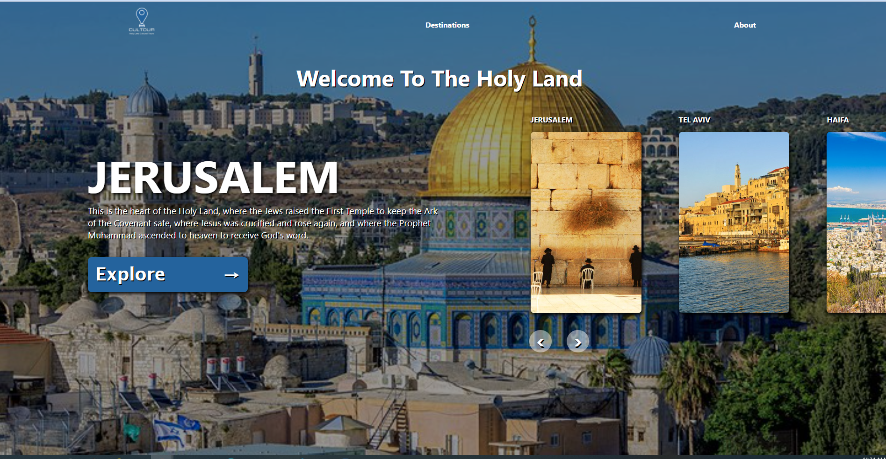

# Cultour 
----------------------
## AppleSeeds Hackathon Group Project 

## Team Members: 
* Ahmad Zughaer 
* Emanuel Yaish
* Svetlana Gaydey
* Tal Wind
* Rouge Nijem
* Samer Siam

## Project Goals 
* Create an Application that promotes all the different faiths and cultures in the Holy Land.
  
* Display major places of attraction by city/geographical area. 

* When a user chooses a destination, display major attractions and places of visit for that place.
_______________________
## Architecture 

____________________
## Layout 

_____________________
## Challenges & Lessons Learned

* Team Dynamics: first time working together, communication issues, setting expectations, etc… 

* Technology : Puppeteer Scraper, AWS, Translation,Front End Animations.

* Git/Github: Learning curve. 

[Live Demo](https://cultour-app.herokuapp.com/
)
